# capstone_1

## Coffee Quality
* https://www.kaggle.com/volpatto/coffee-quality-database-from-cqi?select=arabica_data_cleaned.csv
* Arabica and Robusta data (origin, bitterness, sweetness, color, overall quality)
* Compare each bean type for what makes a good cup of coffee, and then merged data to explore and compare/contrast
* Are their any shared characteristics that make a quality cup? Which countries/farms have the highest quality? 

# Global Quality of Arabica Coffee Samples
## According to trained reviewers from the Coffee Quality Institute

The main data was pulled from the Coffee Quality Institute's review pages in January of 2018. The raw data contains reviews of 1312 Arabica and 28 Robusta coffee beans. 

Due to the dearth of Robusta reviews, this analysis will focus solely on the Arabica species of coffee (although further research in the future would certainly include finding more data on Robusta for a more "robust" data exploration).

The intent behind the analysis was simple: as a personal fan of coffee, I wanted to know what it is that makes a good cup of coffee? The best cup of coffee? The worst? And also, to discover more about the origination of the coffee that many drink every day.

Each element in this data set is a 2 kilogram sample that was sent by the coffee owner (often the farmer or farm, but not always) to the Coffee Quality Insitute for evaluation. The dataset contains the quality metrics by which the coffee was evaluated and resulting scores, metadata about the bean, and metadata on the originating farm. As mentioned, before cleaning there was 1312 rows of data and 44 columns.

Additionally, to aid in the analysis by hemisphere, I used a second data set on country information including only country name, latitude, and longitude (of roughly the respective country center). This [Kaggle Data](https://www.kaggle.com/eidanch/counties-geographic-coordinates) was originally pulled from a Google open dataset.

In initially looking at the data, a few columns were irrelevant (too many null values, no explanatory power, redundant), but of the useful columns they were surprisingly whole. There were a few misplaced decimals and spelling errors to correct, but very few null values that were dropped.

Start off exploratory data analysis by looking at the usual suspects, df.shape, df.info, df.describe, to get a feel for the columns and data. A few columns were irrelevant (too many null values, no explanatory power, redundant), but of the useful columns they were surprisingly whole. There were also few misplaced decimals and spelling errors to correct, but very few null values that were dropped.

At this point I start removing any excess columns (for example there was an unnamed column, and also a column that was just the lower case version of another column). It also starts becoming apparent which columns are going to be central to the analysis.

I considered the columns in roughly two groups: quality measures and bean metadata (including origin/farm)).

### The quality measures:

* Aroma                  
* Flavor                 
* Aftertaste             
* Acidity                
* Body                   
* Balance             
* Uniformity            
* Clean.Cup              
* Sweetness             
* Cupper.Points      
* Total.Cup.Points       
* Moisture                
* Color
* Quakers
* Category.One.Defects  
* Category.Two.Defects   

### Bean Metadata:

* Owner
* Country of Origin
* Farm Name
* Lot Number
* Mill
* Company
* Altitude
* Region
* Processing Method
* Species (Arabica / Robusta)

After that I start plotting the distribution of samples according to a number of factors. First thought, let's take a look at the number of samples by country of origin.

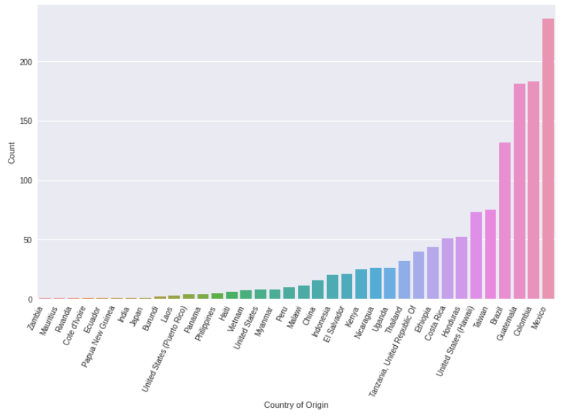

Now that we can see how the samples are distributed, I'd like to see how each of these countries fairs by total points, or total cup points.

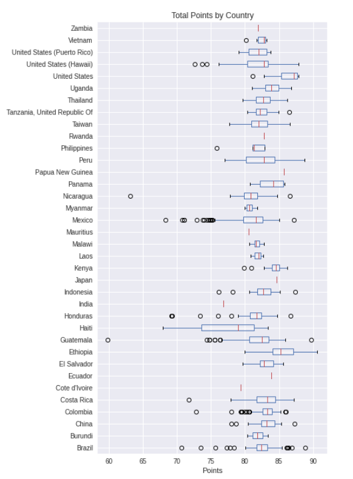

In addition to species, the samples are also broken down further by variety. Let's see how the distribution of varieties looks amongst the samples.

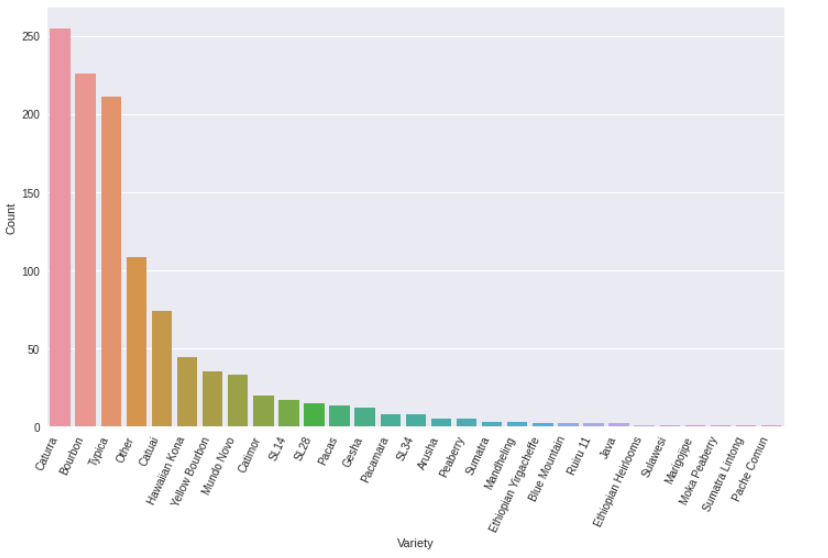

And just like with the countries of origin, let's see the breakdown of the total point spread by variety.

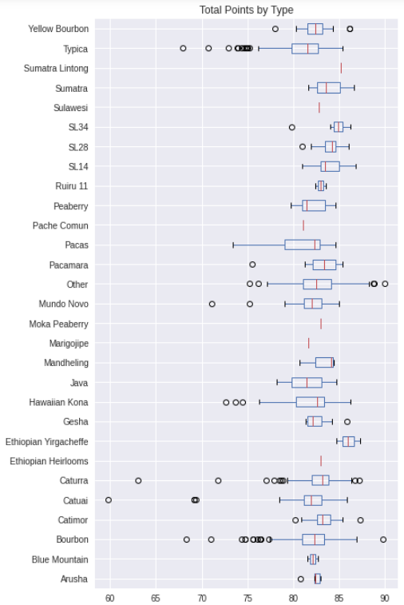

Now to turn more towards the numerical side, I plotted a correlation heatmap to get a better idea about these measures.

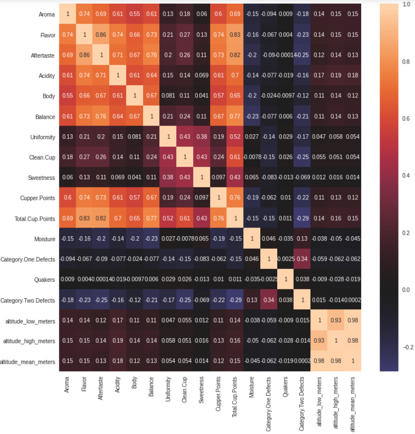

Looking at rubric by which coffee is scored, obvious choices like acidity, aftertaste, body or mouthfeel. Moisture and uniformity I thought were initially good to include but as almost all scores in these categories were 10s I did not feel they ultimately added much to the analysis. Sweetness would also seem important, but again almost all scored 10 so not so much explanatory power. Of the "taste" metrics, I plotted a scatter matrix with Kernel Density on the diagonal.

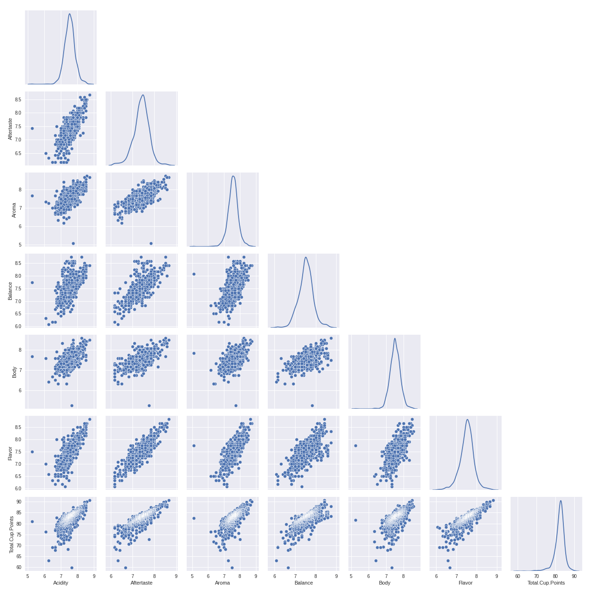

# Research on what these defects mean

Narrow down to 'Acidity', 'Aftertaste', 'Aroma', 'Balance', 'Category.One.Defects', 'Category.Two.Defects','Body', 'Flavor', as well as the primary column by which the coffee is ultimately scored, the 'Total.Cup.Points.' Including defects to check for negative correlation with total points.

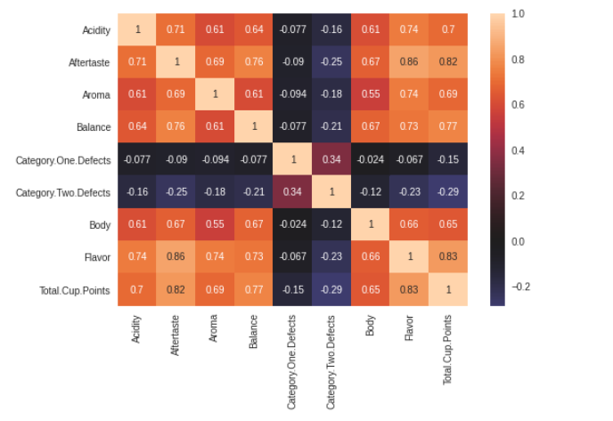

Total Points or Total Cup Points are the primary attribute by which we'll guage the quality of a sample of coffee, so briefly want to look at the distribution of Total Cup Points. I calculated the mean and standard deviation of the actual distribution in order to compare to a normal distribution with the same mean and standard deviation. Those values are 82.179 and 2.686 respectively.

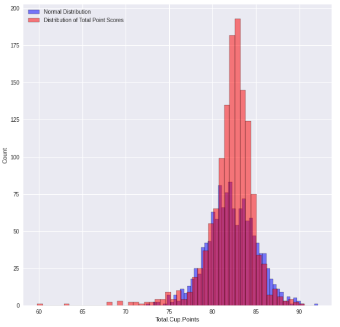

Plotting the distribution of Total Cup Points reveals that it is not exactly normally distributed. It displays excess kurtosis, so would be called a leptokurtic distribution. This refers to the "peak" in the middle and fatter tails as compared to the normal distribution. I decided to use bootstrapping in order to normalize the distribution and get a confidence interval for the population mean. What would the average cup of coffee score?

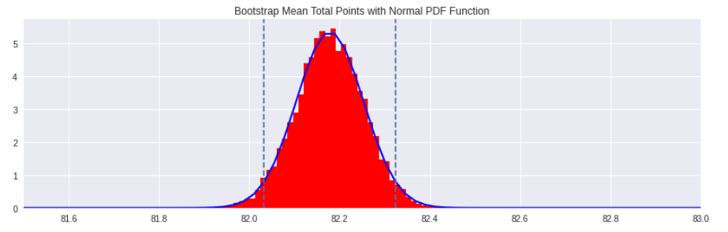

With 95% confidence I can say that of the coffee reviewed by the Coffee Quality Institute, the mean Total Cup Point score is between 82.034 and 82.322.

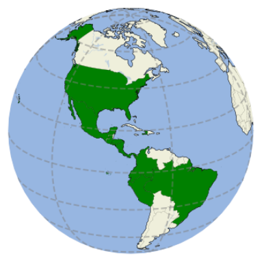 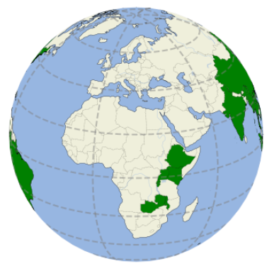
| | 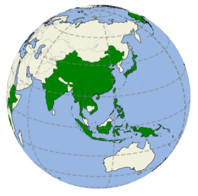 |  |

In looking for plotting geographical data from the global perspective, first encountered basemap (which is apparently deprecated and would not work with currently supported Pandas or Matplotlib), so switched to Cartopy package. Using a shapefile and the .reader method to extract and plot the countries of origin.

Coffee grown all over the world, what separates coffee from one region from another? Start with cutting world in two using other CSV of country data: Northern and Southern Hemispheres. For the sake of simplicity (while I acknowledge that some countries are on both hemispheres), separated according to latitude of roughly the center of the country.

Unfortunately the Cartopy shapefile did not explicitly have data regarding in which hemispheres the countries lay, so that was when I imported the second dataset and ultimately merged the DataFrames on country name. I split the data into two sets according to latitudes above and below 0.

First test if quality of coffee coming from the Northern and Southern hemispheres is significantally different.

* H&0 is that the quality of coffee is the same regardless of whether it comes from the Northern or Southern hemispheres.
* H&A is that hemisphere matters with regards to coffee quality.

As the point distribution was not normal, in order to use the t-test I boostrapped the Total Cup Point score for the North and South and uses the Scipy.Stats module.

Ultimately the p-value was incredibly small, in fact it came back as 0. If we look at the graph you can see why, the bootstrapped score distributions barely overlap and in fact it appears that coffee from the Southern hemisphere is markedly better.

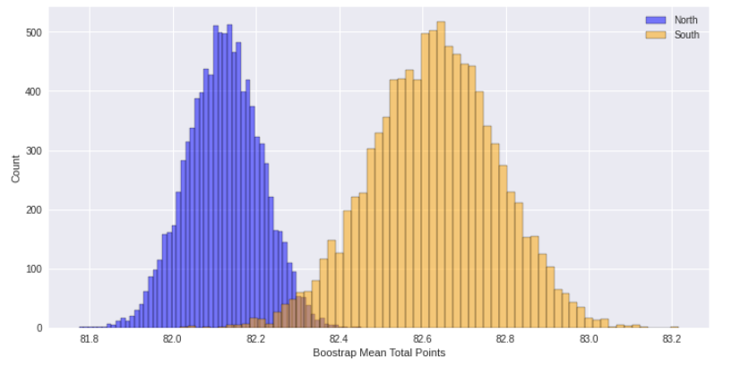

Remembering back to the sample count per country, Mexico by far has supplied the most samples. I wanted to test whether that could indicate Mexican coffee is better or worse than rest of world? Or in other words, could coffee from Mexico be representative of the global quality of coffee?

* H&0 is that the quality of Mexican grown coffee is no different from the rest of the globe.
* H&A is that coffee from Mexico is statistically significantly different.

Same process as above, and once again the p-value was incredibly small. I looked at it out to 9 decimals and it still showed as 0.000000000. In this case, the difference in quality is even more clearly different. Unfortunately not in Mexico's favor.

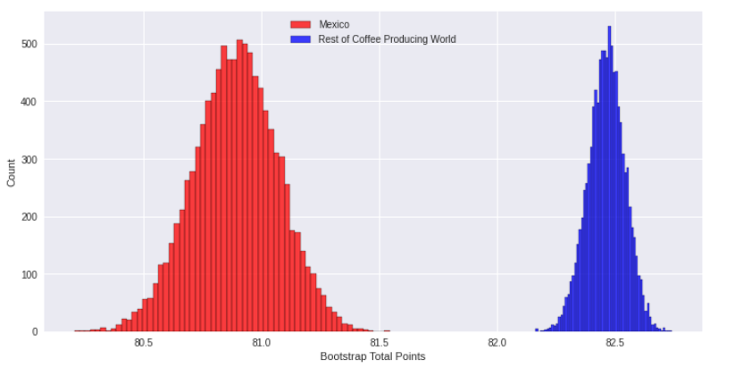

I then moved on to look at altitude. Like many crops, coffee has a particular zone or sweet spot for growing as far as altitude. To investigate further I plotted Total Cup Points by altitude.

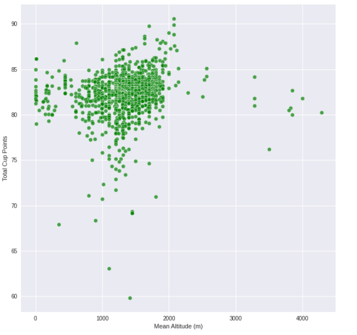

Plotting the data it appears that the majority of the samples are grown between 1000 and 2000 meters, there is some evidence to suggest a positive correlation between altitude and quality at least up to 2000 meters.

This led me to my next question: is coffee grown around 2000 meters statistically significantly better? This time I wanted to try a one-tail test.

* H&0 is no difference in quality between samples from around 2000 m and other altitudes
* H&A is coffee grown at around 2000 meters is statistically significantly better
  
This time I used the Mann-Whitney U-test as the t-test requires the distributions to be normally distributed, however the Mann-Whitney does not. It's well suited for non-parametric data.

It turns out that the p-value that coffee grown around 2000 meters statistically significantly better is roughly 0.000000001. A more ambiguous result!

# poisson distribution? Hypothesis test? Log likelihood
# Use mean and std of total.cup.points to plot pdf or PMF if normal. Hypothesis test if normal?
# Run CLT or boostrap from point stats (plot compared to normal dist with same mean, std)
# What would regression do? goal of regression?

As a sort of summary of the findings, I created a three-dimensional scatter plot showing the relationship between altitude, latitude, and total points.

Finally, I wanted to perform a linear regression on the chosen metrics to see if I could create a fit model to explain the Total Cup Points. I went with the Ordinary Least Squares regression as at least intuitively the simplest choice given the number of parameters.

After the first OLS I decided to try and see if I could improve by removing the variable that seemed to have the least power, and thus retried the OLS but replaced category two defects with mean altitude. However, after plotting the results on top of each other, along with the actual distribution of scores, it does not appear to have meaningfully changed the estimations. Not surprised by that given the extremely high F stat and R2, so may be better suited for a different type of regression. 

If I were to further research, I'd like to find Robusta coffee bean data to add, as well as try predictive regression as these factors are probably highly correlated with each other. I'd also like to delve into the time series data later on for factors like weather, time of year, and harvest years.
